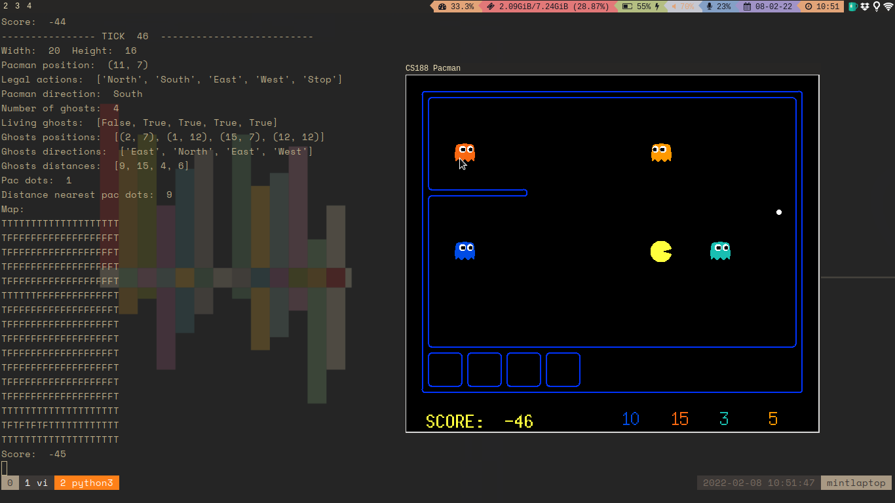

Alvaro Viejo & Alejandro Mayo
# Pac-man first delivery report
This is the report for the first assignment on the **Machine Learning I** course. 

In this report we will find all the notes on the resolution and answers to the proposed exercises.

### Exercise 1:
In the game interface we can see pacman along with 4 different ghosts.

If we do not specify any flags, `python busters.py` defaults to using the keyboard agent, letting the user take control of the movements. It will also default to use a simple test-bench map with a single wall.

In the terminal we can see info about the game's runtime, like the map's width and height, pacman's position, the permitted directions in which to move in, the current direction, the number ghosts alive, etc.

We can also see a small sketch of the current map.
As we can see, Pacman's initial position is 12,10.

### Exercise 2
The most usefull information would be the pacman position, the position of the ghost and also the map to see if there would be an obstacle blocking the shortest possible path of pacman to a ghost, for this we could use the legal actions information, important also to point out the living ghost where the first object is always false as its a reference to our character, pacman.

### Exercise 3

There are 18 files with different mazes. Our maze will be

## Notes

### Exercise 4
When we execute  python busters.py -p BasicAgentAA command we can see the terminal with pacman direction, number ghos, living ghost, their positions, directions and distances. It also appears the distance to the nearest pac dot and how many pac dots there are. Also a representation of the map and score. On the interface we just see the game to see the map easily and their positions.
The most useful information in my opinion is the position of the ghost and if they are alived ghosts, to see what you have to focus, their distances and also the map. The score or dots doesn't seems so important in order to win the game.